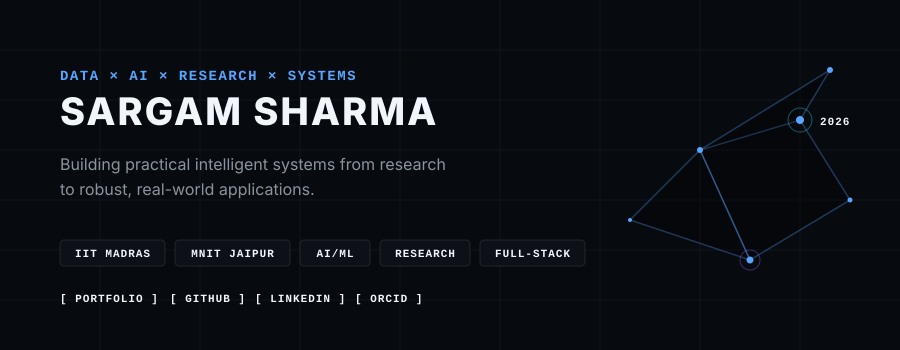
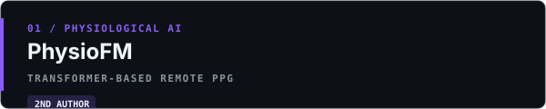
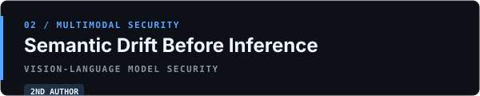
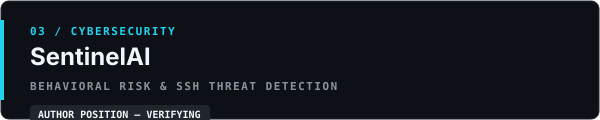
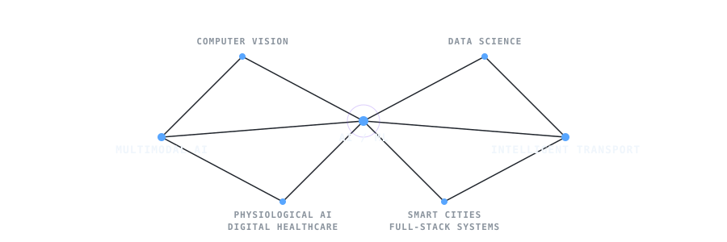
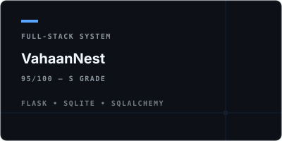
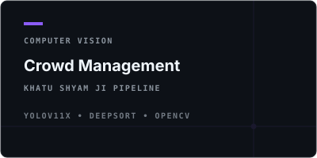
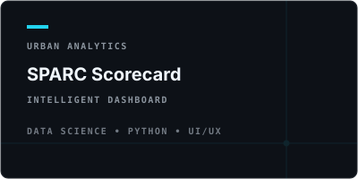
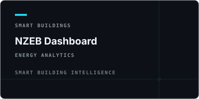
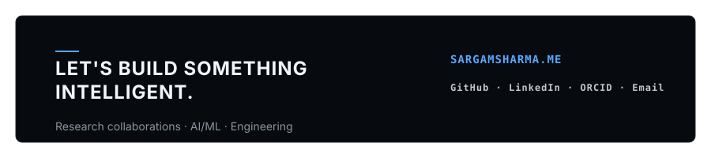

<a href="https://SargamSharma.me">
  <picture>
    <source media="(prefers-color-scheme: dark)" srcset="assets/brand/hero-dark.svg">
    <source media="(prefers-color-scheme: light)" srcset="assets/brand/hero-light.svg">
    
  </picture>
</a>

 

**<a href="https://SargamSharma.me">Portfolio</a>**  • 
**<a href="https://github.com/Sargam20">GitHub</a>**  • 
**<a href="https://www.linkedin.com/in/sargam-sharma-9664b1301/">LinkedIn</a>**  • 
**<a href="https://orcid.org/0009-0005-7293-195X">ORCID</a>**  • 
**<a href="mailto:sargam.sharma1509@gmail.com">Email</a>**

 

`IIT MADRAS`  `MNIT JAIPUR`  `AI / ML`  `DATA SCIENCE`  `RESEARCH`  `FULL-STACK`

  

## 01 / IDENTITY

I am an undergraduate student at **IIT Madras** (B.S. Data Science), working across machine learning, computer vision, data, and full-stack engineering. My primary focus is moving AI from models into deployed systems—converting research ideas into practical applications spanning intelligent transportation, digital healthcare, and smart urban mobility.

 
  <picture>
    
  </picture>

---

## 02 / RESEARCH

**04 RESEARCH WORKS** — four research works identified; metadata is being independently verified before publication.

 

  <picture>
    
  </picture>

<strong>PhysioFM — Research Details</strong>

 

A Diagnostic Framework for Transformer-Based Remote Photoplethysmography.

**Authors:** Shashwat Anil Kumar Upadhyay, Sargam Bijendra Sharma, Prof. Nand Kumar, Dr. Sundeep Kumar  
**Affiliations:** IIT Madras / MNIT Jaipur / Shah and Anchor Kutchhi Engineering College  

Contactless physiological monitoring using transformer-based remote photoplethysmography (rPPG) and multimodal sensing. Explores robust waveform reconstruction, heart-rate estimation, and respiratory monitoring using RGB and thermal/infrared sensing under varying illumination and motion.

**Research areas:** Remote PPG · Physiological AI · Multimodal Learning · Transformers

 

  <picture>
    
  </picture>

<strong>Semantic Drift Before Inference — Research Details</strong>

 

A Preprocessing Attack Surface in Vision–Language Models.

**Authors:** Shashwat Anil Kumar Upadhyay, Sargam Bijendra Sharma, Dr. Rohan Appasaheb Borgalli, Dr. Rupali Vairagade  

Investigates preprocessing attacks in Vision-Language Models, exploring semantic drift, RGB-to-RGB transformations, and background compositing. Introduces the concept of Semantic Equivalence Verification (SEV) to mitigate Conditional Semantic Drift Attacks across trust boundaries.

**Research areas:** AI Security · Vision–Language Models · Multimodal Security · Adversarial Preprocessing

 

  <picture>
    
  </picture>

<strong>SentinelAI — Research Details</strong>

 

An Adaptive Behavioral Risk Framework for Real-Time SSH Threat Detection and Automated Response.

Addresses SSH authentication threats, credential stuffing, and automated adversarial tooling using adaptive behavioral risk detection. Employs isolation forests and anomaly detection for zero-day threat identification and automated mitigation through real-time behavioral signals.

**Research areas:** Cybersecurity · Behavioral Risk Detection · SSH Threat Detection · Automated Response

## 02 / RESEARCH WORKS

 

  <h3>04 RESEARCH WORKS</h3>

 

<table>
  <tr>
    <td width="50%" align="center" valign="top">
      
        
      <code>VERIFIED</code> &nbsp; <code>2ND AUTHOR</code>
      
<i>Contactless continuous respiratory monitoring and multimodal representation learning using RGB–Thermal sensing.</i>

    </td>
    <td width="50%" align="center" valign="top">
      
        
      <code>VERIFIED</code> &nbsp; <code>2ND AUTHOR</code>
      
<i>Researching the security and semantic drift of Vision-Language Models before inference.</i>

    </td>
  </tr>
  <tr>
    <td width="50%" align="center" valign="top">
      
        
      <code>METADATA VERIFYING</code>
      
<i>Cybersecurity research focusing on SSH threat detection and intelligent mitigation.</i>

    </td>
    <td width="50%" align="center" valign="top">
      
        
      <code>ACCEPTED — IAUC 2026</code>
      
<i>An open architecture framework for integrating and optimizing intelligent multimodal transportation systems, developed during research at the AMRUT Centre, MNIT Jaipur.</i>

    </td>
  </tr>
</table>

 

  <picture>
    
  </picture>

---

## 03 / CURRENT FOCUS

<table>
  <tr>
    <td width="50%" valign="top">
      <h3>Intelligent Transportation</h3>
      Researching unified fare management, NCMC integration, and route optimization for the <b>Jaipur Unified Mobility and Transportation Authority (JUMTA)</b>.
    </td>
    <td width="50%" valign="top">
      <h3>Multimodal Physiological AI</h3>
      Exploring contactless continuous respiratory monitoring and multimodal representation learning using RGB–Thermal sensing.
    </td>
  </tr>
  <tr>
    <td width="50%" valign="top">
      <h3>Computer Vision</h3>
      Developing real-time crowd monitoring pipelines using <b>YOLOv11x + DeepSORT</b> and density-estimation models.
    </td>
    <td width="50%" valign="top">
      <h3>Smart Urban Systems</h3>
      Prototyping Digital Twin concepts, GIS integration, and analytical energy dashboards for smart building intelligence.
    </td>
  </tr>
</table>

---

## 04 / ENGINEERING WORK

<table>
  <tr>
    <td width="50%" align="center">
      
    </td>
    <td width="50%" align="center">
      
    </td>
  </tr>
  <tr>
    <td width="50%" align="center">
      
    </td>
    <td width="50%" align="center">
      
    </td>
  </tr>
</table>

---

## 05 / EXPERIENCE

### 2026
**R&D / Research Intern**  
**Malaviya National Institute of Technology (MNIT) Jaipur — AMRUT Centre**  
*Under the guidance of Prof. Nand Kumar*

- Contributed to interdisciplinary research in **Intelligent Multimodal Transportation Systems** and **AI-driven Digital Healthcare**.
- Authored research accepted for presentation at international conferences (IAUC 2026).
- Developed real-time computer vision pipelines and intelligent dashboards for urban mobility.
- **Domains:** `Urban Mobility` • `Computer Vision` • `Smart Buildings` • `Digital Healthcare`

---

## 06 / EDUCATION

**INDIAN INSTITUTE OF TECHNOLOGY MADRAS**  
*B.S. Data Science and Applications*  
`2023 — 2027`

---

## 07 / TECHNOLOGY

<table>
  <tr>
    <td width="25%"><b>LANGUAGES</b></td>
    <td>
      
      
      
      
      
      
      
    </td>
  </tr>
  <tr>
    <td><b>INTELLIGENCE</b></td>
    <td>
      
      
      
      
    </td>
  </tr>
  <tr>
    <td><b>BACKEND / DATA</b></td>
    <td>
      
      
      
      
      
      
      
      
      
    </td>
  </tr>
  <tr>
    <td><b>FRONTEND / DESIGN</b></td>
    <td>
      
      
      
      
      
      
      
    </td>
  </tr>
  <tr>
    <td><b>ENGINEERING</b></td>
    <td>
      
      
      
      
      
      
    </td>
  </tr>
</table>

---

## 08 / ACTIVITY

     
  <code>ACTIVITY DATA INITIALIZING</code>
      

  

  <a href="https://SargamSharma.me">
    <picture>
      <source media="(prefers-color-scheme: dark)" srcset="assets/brand/footer-dark.svg">
      <source media="(prefers-color-scheme: light)" srcset="assets/brand/footer-light.svg">
      
    </picture>
  </a>

