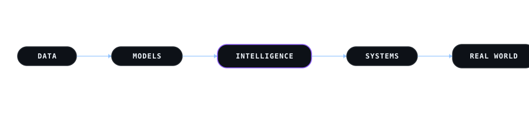
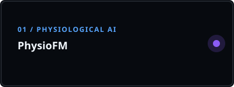
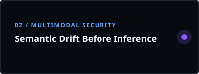
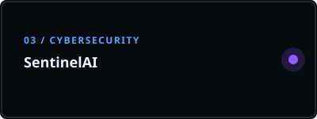
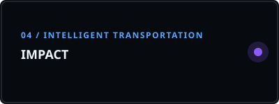

  
  <h1>Hi! I'm Sargam.</h1>
  <h3>Data Science & AI Researcher</h3>
  
with a passion for building practical intelligent systems from research to robust, real-world applications.

 

  <h1><code>&lt;/&gt;</code> &nbsp;&nbsp;&nbsp;&nbsp;&nbsp;&nbsp;&nbsp;&nbsp;&nbsp;&nbsp;&nbsp;&nbsp;&nbsp;&nbsp;&nbsp;&nbsp;&nbsp;&nbsp;&nbsp;&nbsp;&nbsp;&nbsp;&nbsp;&nbsp;&nbsp;&nbsp; <code>&lt;/&gt;</code> &nbsp;&nbsp;&nbsp;&nbsp;&nbsp;&nbsp;&nbsp;&nbsp;&nbsp;&nbsp;&nbsp;&nbsp;&nbsp;&nbsp;&nbsp;&nbsp;&nbsp;&nbsp;&nbsp;&nbsp;&nbsp;&nbsp;&nbsp;&nbsp;&nbsp;&nbsp; <code>&lt;/&gt;</code></h1>

 

## 𝐇𝐞𝐥𝐥𝐨 𝐭𝐡𝐞𝐫𝐞, 𝐟𝐞𝐥𝐥𝐨𝐰 &lt;𝚌𝚘𝚍𝚎𝚛 /&gt;!  

> [!CAUTION]
> - 🔖 Congratulations you found me

> [!NOTE]
> - 🚙 I'm currently working on **Intelligent Transportation** (NCMC integration) and **Multimodal Physiological AI**.

> [!IMPORTANT]
> - 📚 I'm currently learning **Advanced Computer Vision** (YOLOv11x, DeepSORT).

> [!WARNING]  
> - 💪🏼 Future Goals: Prototyping Digital Twin concepts for smart building intelligence - Never stop creating new ideas.

> [!TIP]  
> - 📗 If you're interested in collaborating on AI/ML research or have any questions — I'd love to hear from you!

> 

>   
>   
>   
>   
> 

---

 

  

<h3 align="center">
   
  
  【Ｓｋｉｌｌｓ】  
</h3>

  

  

| Programming_Languages | Frontend_Tools | Backend_Tools | Data_Related | IDEs/Softwares | Other_Tools |
| :---: | :---: | :---: | :---: | :---: | :---: |
|  |  |  |  |  |  |
|  |  |  |  |  |  |
|  |  |  |  |  |  |
|  |  |  |  |  |  |

---

  

<h3 align="center">
   
  
  【Ｒｅｓｅａｒｃｈ　＆　Ｐｒｏｊｅｃｔｓ】  
</h3>

  

 

  <picture>
    
  </picture>

 

<table>
  <tr>
    <td width="50%" align="center" valign="top">
      
        
      <code>✅ VERIFIED</code> &nbsp; <code>🥈 2ND AUTHOR</code>
      
<i>Contactless continuous respiratory monitoring and multimodal representation learning using RGB–Thermal sensing.</i>

    </td>
    <td width="50%" align="center" valign="top">
      
        
      <code>✅ VERIFIED</code> &nbsp; <code>🥈 2ND AUTHOR</code>
      
<i>Researching the security and semantic drift of Vision-Language Models before inference.</i>

    </td>
  </tr>
  <tr>
    <td width="50%" align="center" valign="top">
      
        
      <code>⏳ METADATA VERIFYING</code>
      
<i>Cybersecurity research focusing on SSH threat detection and intelligent mitigation.</i>

    </td>
    <td width="50%" align="center" valign="top">
      
        
      <code>🏆 ACCEPTED — IAUC 2026</code>
      
<i>An open architecture framework for integrating and optimizing intelligent multimodal transportation systems, developed during research at the AMRUT Centre, MNIT Jaipur.</i>

    </td>
  </tr>
</table>

---

  

<h3 align="center">
   
  
  【Ａｃｔｉｖｉｔｙ】  
</h3>

  

   
  
  <!-- Awesome GitHub Stats -->
  

     

  <!-- Interactive Pac-Man Contribution Chart -->
  <h3>🕹️ GitHub Contribution Graph</h3>
  
  <a href="https://github.com/Sargam20">
    <picture>
      <!-- Ensure you trigger the pacman action to generate this image! -->
      
    </picture>
  </a>
  

    <code>PAC-MAN ANIMATION INITIALIZING</code>
  

